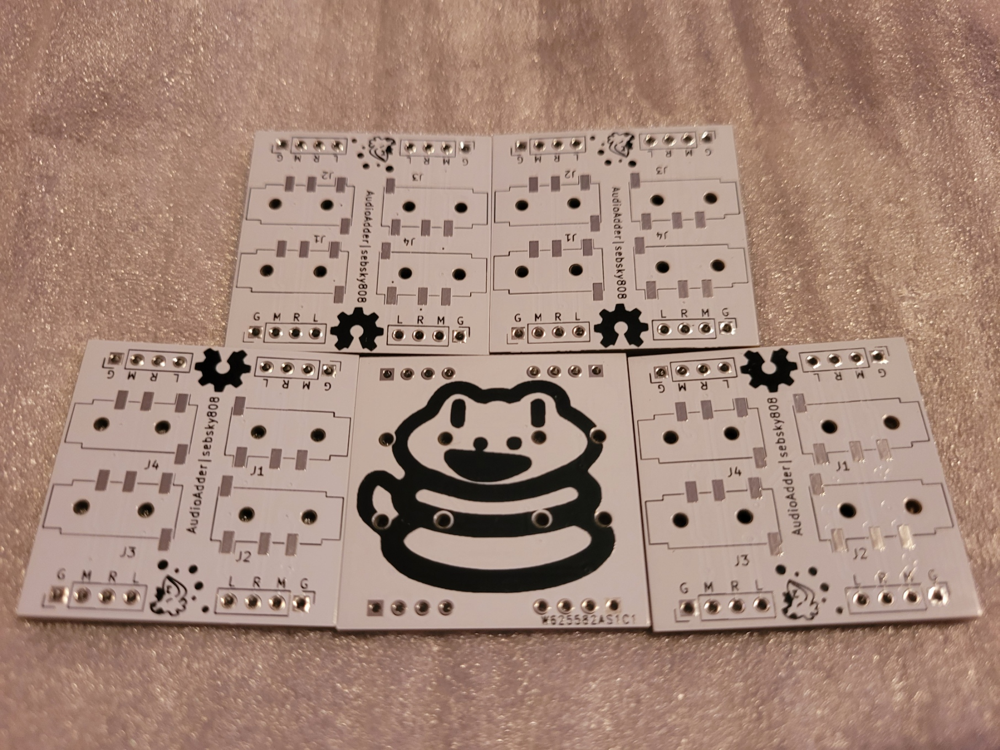

# AudioAdder

The AudioAdder is a PCB designed to combine 4+ 3.5mm TRRS jacks by connecting each of the 4 channels from each port. The unique gimmick of this design is that a near infinite number of combined ports can be achieved by soldering multiple AudioAdder boards together, which in short, means they can be chained together!  The 4x1 pinholes mirror their pinout to prevent soldering errors, and 2 rows of pin headers per side increases overall durability. Additionally, the edge pins can also be used to probe each channel with an oscilloscope.

**NOTE:** Silkscreen labels for each channel follow OMTP/Nokia convention.

## Components
* PJ320-D 3.5mm TRRS barrel (x4 per board)
* 1x4 pin headers (x2/x4 per board) (optional)

## Example Configurations
Due to how common and versatile 3.5mm jacks are, there are a wide range of configurations
for the AudioAdder. Here are just a few!
### 2+ computers and 1+ speaker/headphones
Play audio from 2 or more computers on 1 or more speakers/headphones.
### 2+ GameBoys and a computer
Mix 2 or more Gameboys running Little Sound DJ while recording on a computer.
### An oscilloscope, a computer, and speakers/headphones
Use an oscilloscope to probe audio on each channel while listening to
the audio to get a live look at the waveform of what you are listening to!

## License
Licensed under the [TAPR Open Hardware License](www.tapr.org/OHL)

## Credits
* **Schematics & board designs:** [sebsky808](https://github.com/sebsky808)

## Special Thanks
* **Designed with:** [KiCAD](https://www.kicad.org/)

## Support
If you find this project interesting or helpful, consider supporting me on [ko-fi](https://ko-fi.com/sebsky808), it would be much appreciated!